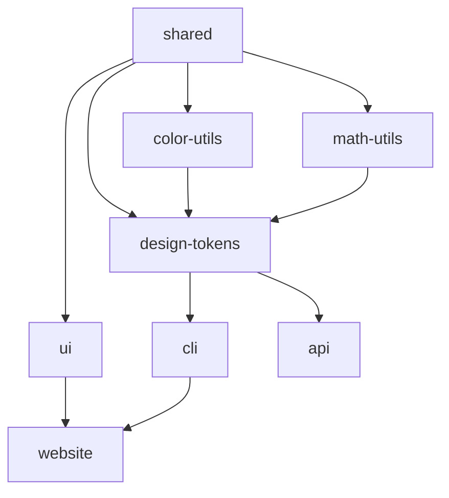

# Rafters Architecture Documentation

## 1. System Overview

### High-Level Architecture

```
┌─────────────────────────────────────────────────────────────────────┐
│                          DESIGN CREATION                             │
│  ┌──────────┐    ┌──────────┐    ┌──────────┐    ┌──────────┐     │
│  │ Designer │───▶│  Studio  │───▶│  Tokens  │───▶│   SQID   │     │
│  └──────────┘    └──────────┘    └──────────┘    └──────────┘     │
└─────────────────────────────────────────────────────────────────────┘
                                    │
                                    ▼
┌─────────────────────────────────────────────────────────────────────┐
│                          DATA DISTRIBUTION                           │
│  ┌──────────┐    ┌──────────┐    ┌──────────┐    ┌──────────┐     │
│  │  Archive │───▶│    CLI   │───▶│    MCP   │───▶│ AI Agent │     │
│  └──────────┘    └──────────┘    └──────────┘    └──────────┘     │
└─────────────────────────────────────────────────────────────────────┘
                                    │
                                    ▼
┌─────────────────────────────────────────────────────────────────────┐
│                       INTELLIGENCE GENERATION                        │
│  ┌──────────┐    ┌──────────┐    ┌──────────┐    ┌──────────┐     │
│  │Color API │───▶│ Vectorize│───▶│  Claude  │───▶│ Registry │     │
│  └──────────┘    └──────────┘    └──────────┘    └──────────┘     │
└─────────────────────────────────────────────────────────────────────┘
```

### Data Flow

1. **Designer → Studio**: Visual design decisions are made in Rafters Studio
2. **Studio → Tokens**: Design choices are encoded as semantic tokens with intelligence metadata
3. **Tokens → Archive**: Token sets are packaged into `.rafters/tokens/` JSON archives (10 files)
4. **Archive → CLI**: CLI fetches and installs token archives via SQID identifiers
5. **CLI → MCP**: Model Context Protocol server provides AI agents with direct access
6. **MCP → AI Agent**: AI agents query design intelligence for implementation decisions
7. **API → Intelligence**: Color Intelligence API enriches tokens with AI-generated insights

### Key Innovations

**Design Taste as Data**: Rafters encodes subjective design taste as objective, queryable data through:
- **Mathematical relationships** between design elements
- **Cognitive load calculations** for user experience
- **Trust level hierarchies** for visual attention management
- **Accessibility matrices** for inclusive design
- **Semantic meaning** for contextual usage rules

**Custom Shadow DOM Component Preview System**: Unlike traditional documentation tools (Storybook, Docusaurus, etc.), Rafters features a purpose-built component preview system:
- **~500 lines of custom code** replacing heavy external dependencies
- **Shadow DOM isolation** ensuring perfect style encapsulation
- **Intelligence metadata display** showing cognitive load, attention economics, trust patterns
- **Registry integration** automatically pulling component intelligence
- **Dynamic prop handling** via JSON parsing with live updates
- **MDX seamless integration** for comprehensive documentation workflow

This architectural decision transforms component documentation from static visual demos into interactive design intelligence showcases, enabling AI agents to understand not just what components look like, but how they affect user cognition and attention.

## 2. Core Packages

### design-tokens Package

**Purpose**: Central intelligence engine for design token management and distribution

#### Archive System
- **Location**: `.rafters/tokens/` directory
- **Structure**: 10 categorized JSON files
  - `color.json` - Color tokens with full ColorValue intelligence
  - `spacing.json` - Mathematical spacing progressions
  - `typography.json` - Font sizes, weights, families
  - `motion.json` - Animation durations and easings
  - `shadow.json` - Elevation and depth tokens
  - `border-radius.json` - Corner radius scale
  - `z-index.json` - Layering system
  - `opacity.json` - Transparency values
  - `breakpoint.json` - Responsive breakpoints
  - `registry.json` - Complete design system metadata

#### SQID Distribution
```typescript
// Generates unique short codes for design system distribution
const generateShortCode = () => {
  const s = new sqids();
  return s.encode([Date.now()]);
};
```
- Time-based unique identifiers
- Human-readable short codes
- Enables easy sharing: `rafters init SQID123`

#### TokenRegistry Runtime Intelligence
```typescript
export class TokenRegistry {
  private tokens: Map<string, Token> = new Map();
  public dependencyGraph: TokenDependencyGraph;
  private ruleParser: GenerationRuleParser;
  private ruleExecutor: GenerationRuleExecutor;
}
```
- **O(1) token lookups** via Map structure
- **Dependency tracking** for cascading updates
- **Rule execution** for dynamic token generation
- **Intelligence preservation** during operations

#### Dependency System (5 Rule Types)

1. **calc**: Mathematical calculations
   ```typescript
   { rule: "calc(primary.l * 0.8)", type: "calc" }
   ```

2. **state:hover**: Interactive state variations
   ```typescript
   { rule: "state:hover(primary, 1.1)", type: "state" }
   ```

3. **scale:600**: Scale position references
   ```typescript
   { rule: "scale:600(primary)", type: "scale" }
   ```

4. **contrast:auto**: Automatic contrast adjustment
   ```typescript
   { rule: "contrast:auto(background, AA)", type: "contrast" }
   ```

5. **invert**: Color inversion for dark mode
   ```typescript
   { rule: "invert(primary)", type: "invert" }
   ```

#### Plugin System
```typescript
interface GenerationRulePlugin {
  name: string;
  execute(params: string[], registry: TokenRegistry): string;
}
```
- Extensible rule engine
- Custom token generation logic
- Third-party plugin support

#### ColorValue Intelligence Object
```typescript
interface ColorValue {
  name: string;
  family: string;
  scale: OKLCH[];  // 11-step scale (50-950)
  intelligence: {
    suggestedName: string;
    reasoning: string;
    emotionalImpact: string;
    culturalContext: string;
    accessibilityNotes: string;
    usageGuidance: string;
  };
  harmonies: {
    complementary: ColorReference;
    analogous: ColorReference[];
    triadic: ColorReference[];
    splitComplementary: ColorReference[];
  };
  accessibility: {
    contrastOnWhite: number;
    contrastOnBlack: number;
    wcagAA: boolean;
    wcagAAA: boolean;
  };
  perceptualWeight: {
    weight: number;
    density: 'light' | 'balanced' | 'heavy';
    balancingRecommendation: string;
  };
  states: Record<string, string>;  // Hover, active, disabled
  use: string;  // Primary usage guidance
}
```

#### Dependency Graph & Topological Sorting

**Kahn's Algorithm Implementation**:
```typescript
topologicalSort(): string[] {
  const result: string[] = [];
  const visited = new Set<string>();
  const visiting = new Set<string>();

  const visit = (token: string): void => {
    if (visiting.has(token)) {
      throw new Error('Circular dependency detected');
    }
    if (visited.has(token)) return;

    visiting.add(token);
    for (const dep of this.getDependencies(token)) {
      visit(dep);
    }
    visiting.delete(token);
    visited.add(token);
    result.push(token);
  };

  // Process all tokens
  for (const token of allTokens) {
    if (!visited.has(token)) visit(token);
  }
  return result;
}
```

### color-utils Package

**Purpose**: Mathematical color intelligence calculations

#### Core Capabilities
- **Color space conversions**: sRGB ↔ OKLCH ↔ P3
- **Perceptual uniformity**: OKLCH-based calculations
- **Harmony generation**: Mathematical color relationships
- **Contrast calculations**: WCAG compliance checking

#### Pre-computed Accessibility Matrices
```typescript
// Pre-calculated for performance
const accessibilityMatrix = {
  'primary-background': { ratio: 7.5, AA: true, AAA: true },
  'secondary-background': { ratio: 5.2, AA: true, AAA: false },
  // ... all color combinations
};
```

#### Harmony Generation Algorithms
```typescript
generateHarmonies(baseOklch: OKLCH): Harmonies {
  return {
    complementary: rotateHue(baseOklch, 180),
    analogous: [
      rotateHue(baseOklch, 30),
      rotateHue(baseOklch, -30)
    ],
    triadic: [
      rotateHue(baseOklch, 120),
      rotateHue(baseOklch, 240)
    ],
    splitComplementary: [
      rotateHue(baseOklch, 150),
      rotateHue(baseOklch, 210)
    ]
  };
}
```

#### Atmospheric & Perceptual Weight
```typescript
calculatePerceptualWeight(oklch: OKLCH): PerceptualWeight {
  // Lightness contributes inversely to weight
  const lightnessWeight = (1 - oklch.l) * 0.6;

  // Chroma adds visual density
  const chromaWeight = oklch.c * 0.3;

  // Warm hues feel heavier
  const hueWeight = calculateHueWeight(oklch.h) * 0.1;

  const totalWeight = lightnessWeight + chromaWeight + hueWeight;

  return {
    weight: totalWeight,
    density: totalWeight > 0.6 ? 'heavy' :
             totalWeight > 0.4 ? 'balanced' : 'light',
    balancingRecommendation: generateBalancingAdvice(totalWeight)
  };
}
```

#### Cognitive Load Calculation
```typescript
calculateCognitiveLoad(color: ColorValue): number {
  let load = 0;

  // High saturation increases cognitive processing
  load += color.scale[5].c * 2;

  // Multiple harmonies add complexity
  load += Object.keys(color.harmonies).length * 0.5;

  // State variations add interaction complexity
  load += Object.keys(color.states).length * 0.3;

  return Math.min(10, Math.round(load));
}
```

### math-utils Package

**Purpose**: Mathematical foundations for design token generation

#### Musical Ratios
```typescript
export const MUSICAL_RATIOS = {
  'unison': 1.0,
  'minor-second': 1.059,
  'major-second': 1.122,
  'minor-third': 1.189,
  'major-third': 1.260,
  'perfect-fourth': 1.334,
  'tritone': 1.414,
  'perfect-fifth': 1.498,
  'minor-sixth': 1.587,
  'major-sixth': 1.682,
  'minor-seventh': 1.782,
  'major-seventh': 1.888,
  'octave': 2.0
};
```

#### Golden Ratio & Fibonacci
```typescript
export const MATHEMATICAL_CONSTANTS = {
  'phi': 1.618033988749,      // Golden ratio
  'sqrt2': 1.414213562373,    // Square root of 2
  'sqrt3': 1.732050807568,    // Square root of 3
  'pi': 3.141592653589,       // Pi
  'e': 2.718281828459         // Euler's number
};

// Fibonacci-like progression generation
function generateFibonacciLike(ratio: number, length: number): number[] {
  const sequence = [1, 1];
  for (let i = 2; i < length; i++) {
    sequence.push(sequence[i-1] * ratio + sequence[i-2]);
  }
  return sequence;
}
```

#### Mathematical Expression Evaluation
```typescript
evaluateExpression(expr: string, context: Map<string, number>): number {
  // Tokenize and parse mathematical expressions
  // Supports variables, operators, and functions
  const ast = parseExpression(expr);
  return evaluateAST(ast, context);
}
```

#### Unit-Aware CSS Calculations
```typescript
interface UnitValue {
  value: number;
  unit: CSSUnit;
}

calculateWithUnits(
  a: UnitValue,
  b: UnitValue,
  operation: 'add' | 'subtract' | 'multiply' | 'divide'
): UnitValue {
  // Convert to common unit
  const commonUnit = findCommonUnit(a.unit, b.unit);
  const aConverted = convertUnit(a, commonUnit);
  const bConverted = convertUnit(b, commonUnit);

  // Perform operation
  const result = performOperation(aConverted, bConverted, operation);
  return { value: result, unit: commonUnit };
}
```

### ui Package

**Purpose**: Component intelligence metadata and registry

#### Component Intelligence Structure
```typescript
interface ComponentIntelligence {
  cognitiveLoad: number;        // 1-10 scale
  attentionWeight: number;       // Visual hierarchy position
  trustLevel: 'low' | 'medium' | 'high' | 'critical';
  accessibilityScore: number;    // WCAG compliance rating
  interactionPatterns: string[]; // Common usage patterns
  semanticRoles: string[];       // ARIA and semantic HTML roles
}
```

#### JSDoc Annotation System
```typescript
/**
 * @registryName button
 * @registryVersion 0.1.0
 * @registryStatus published
 *
 * @cognitiveLoad 3/10 - Simple action trigger
 * @attentionEconomics Primary buttons command highest attention
 * @trustBuilding Destructive actions require confirmation
 * @accessibility WCAG AAA compliant with 44px touch targets
 * @semanticMeaning primary=main action, destructive=danger
 */
```

#### Registry Format
```json
{
  "name": "button",
  "version": "0.1.0",
  "status": "published",
  "intelligence": {
    "cognitiveLoad": 3,
    "attentionEconomics": "...",
    "trustBuilding": "...",
    "accessibility": "WCAG AAA",
    "semanticMeaning": {...}
  },
  "dependencies": ["@radix-ui/react-slot"],
  "examples": [...]
}
```

#### Playwright Component Testing
```typescript
test('component cognitive load budget', async ({ page }) => {
  const components = await page.locator('[data-component]').all();
  let totalLoad = 0;

  for (const component of components) {
    const load = await component.getAttribute('data-cognitive-load');
    totalLoad += parseInt(load);
  }

  expect(totalLoad).toBeLessThanOrEqual(15); // Page budget
});
```

### shared Package

**Purpose**: Type safety and validation across the monorepo

#### Zod Schemas
```typescript
export const TokenSchema = z.object({
  name: z.string(),
  value: z.union([z.string(), ColorValueSchema, ColorReferenceSchema]),
  category: z.string(),
  namespace: z.string(),
  semanticMeaning: z.string().optional(),
  cognitiveLoad: z.number().min(0).max(10).optional(),
  trustLevel: z.enum(['low', 'medium', 'high', 'critical']).optional(),
  dependencies: z.array(z.string()).optional(),
  generationRule: z.string().optional()
});
```

#### Core Type Definitions
```typescript
export interface Token {
  name: string;
  value: string | ColorValue | ColorReference;
  category: string;
  namespace: string;
  semanticMeaning?: string;
  cognitiveLoad?: number;
  trustLevel?: TrustLevel;
  dependencies?: string[];
  generationRule?: string;
}

export interface ColorReference {
  family: string;
  position: number;
}
```

#### Validation Rules
```typescript
// Enforce consistency across all data structures
export const validateToken = (token: unknown): Token => {
  return TokenSchema.parse(token);
};

export const validateColorValue = (value: unknown): ColorValue => {
  return ColorValueSchema.parse(value);
};
```

## 3. Applications

### CLI (apps/cli)

#### Command Structure
```bash
rafters init [SQID]           # Initialize design system
rafters generate              # Generate all tokens
rafters export <format>       # Export tokens (css/tw/json)
rafters mcp                   # Start MCP server
rafters registry <command>    # Manage component registry
```

#### Registry Fetching
```typescript
async fetchArchive(shortcode: string): Promise<DesignSystem> {
  const response = await fetch(
    `https://api.rafters.tech/archives/${shortcode}`
  );
  const archive = await response.json();
  return unpackArchive(archive);
}
```

#### Framework Detection
```typescript
detectFramework(cwd: string): Framework {
  const packageJson = readPackageJson(cwd);

  if (packageJson.dependencies?.next) return 'next';
  if (packageJson.dependencies?.remix) return 'remix';
  if (packageJson.dependencies?.vite) return 'vite';
  if (packageJson.dependencies?.tailwindcss) return 'tailwind';

  return 'unknown';
}
```

#### MCP Server Implementation
```typescript
const TOOLS: Tool[] = [
  'get_color_intelligence',
  'get_token_by_category',
  'get_component_intelligence',
  'validate_color_combination',
  'get_accessible_colors',
  'get_tokens_by_trust_level',
  'calculate_cognitive_load'
];

// Direct access to design intelligence
server.setRequestHandler(CallToolRequestSchema, async (request) => {
  const { name, arguments: args } = request.params;
  const registry = createTokenRegistry(tokensDir);

  switch (name) {
    case 'get_color_intelligence':
      return registry.getColorIntelligence(args.tokenName);
    // ... handle other tools
  }
});
```

### API (apps/api)

#### Cloudflare Workers Architecture
```typescript
export default {
  fetch: app.fetch,
  async queue(batch: MessageBatch, env: Env): Promise<void> {
    await processColorSeedBatch(batch, env, app);
  }
};
```

- **Edge-optimized**: Runs at 300+ global locations
- **Queue-based**: Handles batch color generation
- **Durable Objects**: State persistence for caching

#### Color Intelligence Generation
```typescript
async generateColorIntelligence(
  oklch: OKLCH,
  ai: Ai
): Promise<ColorIntelligence> {
  const prompt = constructColorPrompt(oklch);

  const response = await ai.run(
    '@cf/anthropic/claude-3-haiku',
    { prompt, max_tokens: 500 }
  );

  return parseColorIntelligence(response);
}
```

#### Vectorize Caching (384 Dimensions)
```typescript
// Vector structure: 4 OKLCH + 5 semantic + 375 mathematical
function generateVector(color: ColorValue): number[] {
  const vector = new Array(384);

  // OKLCH components (0-3)
  vector[0] = color.scale[5].l;
  vector[1] = color.scale[5].c;
  vector[2] = color.scale[5].h / 360;
  vector[3] = color.scale[5].alpha || 1;

  // Semantic dimensions (4-8)
  vector[4] = color.cognitiveLoad / 10;
  vector[5] = trustLevelToNumber(color.trustLevel);
  vector[6] = color.perceptualWeight.weight;
  vector[7] = color.accessibility.wcagAA ? 1 : 0;
  vector[8] = color.accessibility.wcagAAA ? 1 : 0;

  // Mathematical dimensions (9-383)
  const mathDimensions = generateVectorDimensions(color.scale[5]);
  for (let i = 0; i < 375; i++) {
    vector[9 + i] = mathDimensions[i];
  }

  return vector;
}
```

#### Mathematical Vector Generation
```typescript
function generateVectorDimensions(oklch: OKLCH): number[] {
  const dimensions = new Array(375);
  const hueRad = (oklch.h * Math.PI) / 180;

  // Trigonometric variations for similarity search
  for (let i = 0; i < 125; i++) {
    const factor = (i + 1) * 0.002667;
    dimensions[i] = Math.sin(hueRad * factor) * oklch.c * oklch.l;
  }

  // Chroma-lightness combinations
  for (let i = 125; i < 250; i++) {
    const factor = (i - 124) * 0.008;
    dimensions[i] = Math.cos(hueRad * factor) * oklch.c * oklch.l;
  }

  // Complex harmonic relationships
  for (let i = 250; i < 375; i++) {
    const factor = (i - 249) * 0.008;
    const harmonic = Math.sin(factor * Math.PI);
    dimensions[i] = harmonic * Math.cos(hueRad) * factor * 0.01;
  }

  return dimensions;
}
```

### Website (apps/website)

#### Next.js App Router Structure
```
apps/website/
├── app/
│   ├── (home)/
│   ├── docs/
│   ├── api/
│   └── studio/
├── content/
│   ├── docs/
│   └── guides/
└── components/
    ├── ui/
    ├── registry/
    └── preview/   # Custom Shadow DOM component preview system
```

#### Custom Shadow DOM Component Preview System

**Key Innovation**: Built in ~500 lines, this custom preview system replaces traditional documentation tools with intelligence-aware component showcasing:

```typescript
class RaftersComponentPreview extends HTMLElement {
  private shadowRoot: ShadowRoot;
  private registry: ComponentRegistry;
  private intelligence: ComponentIntelligence;
  private props: ComponentProps;

  constructor() {
    super();
    this.shadowRoot = this.attachShadow({ mode: 'open' });
  }

  connectedCallback() {
    this.loadComponentIntelligence();
    this.setupPropertyControls();
    this.renderPreview();
  }

  private renderIntelligencePanel(): string {
    return `
      <div class="intelligence-metadata">
        <div class="cognitive-load">
          <label>Cognitive Load</label>
          <div class="load-indicator" data-load="${this.intelligence.cognitiveLoad}">
            ${this.intelligence.cognitiveLoad}/10
          </div>
        </div>

        <div class="attention-economics">
          <label>Attention Economics</label>
          <p>${this.intelligence.attentionEconomics}</p>
        </div>

        <div class="trust-building">
          <label>Trust Patterns</label>
          <p>${this.intelligence.trustBuilding}</p>
        </div>

        <div class="accessibility-score">
          <label>Accessibility</label>
          <p>${this.intelligence.accessibility}</p>
        </div>
      </div>
    `;
  }

  private setupPropertyControls(): void {
    const propsPanel = this.shadowRoot.querySelector('.props-panel');

    // Dynamic prop controls based on component schema
    Object.entries(this.props).forEach(([key, propDef]) => {
      const control = this.createPropControl(key, propDef);
      control.addEventListener('change', (e) => {
        this.updateComponentProp(key, e.target.value);
        this.rerenderComponent();
      });
      propsPanel.appendChild(control);
    });
  }
}

customElements.define('rafters-component-preview', RaftersComponentPreview);
```

#### Shadow DOM Benefits Over Traditional Tools

**Perfect Encapsulation**:
- No CSS conflicts between preview and documentation styles
- Component styles render exactly as in production
- Multiple component previews can coexist without interference

**Intelligence Integration**:
- Registry metadata automatically pulled and displayed
- Cognitive load calculations shown in real-time
- Trust patterns and attention economics visible alongside visual preview
- Accessibility scores and guidance integrated into preview experience

**Dynamic Interaction**:
- JSON-based prop manipulation with live updates
- State changes reflected immediately in both component and intelligence metadata
- Interactive cognitive load calculation as props change

#### MDX Seamless Integration
```typescript
// Enhanced MDX frontmatter
interface DocMeta {
  title: string;
  description: string;
  category: 'foundation' | 'components' | 'patterns';
  cognitiveComplexity: number;
  readingTime: number;
  prerequisites: string[];
  previewConfig: {
    showIntelligence: boolean;
    defaultProps: Record<string, any>;
    cognitiveLoadDemo: boolean;
    interactiveProps: string[];
  };
}

// Component documentation with embedded previews
function ComponentDocPage({ component }: { component: ComponentRegistry }) {
  return (
    <div className="component-docs">
      <rafters-component-preview
        component={component.name}
        intelligence={JSON.stringify(component.intelligence)}
        default-props={JSON.stringify(component.examples[0].props)}
      />
      <MDXContent component={component} />
    </div>
  );
}
```

#### Advantages Over Storybook

| Storybook | Rafters Preview System |
|-----------|------------------------|
| Visual component demos | Visual + intelligence metadata display |
| Manual story writing | Automatic registry integration |
| Basic prop controls | Dynamic JSON-based prop manipulation |
| Static documentation | Live cognitive load calculations |
| Separate from docs | Seamlessly integrated with MDX |
| Generic tool | Purpose-built for design intelligence |
| ~500KB bundle overhead | ~500 lines of custom code |
| External dependency | Native to the system |

#### Documentation Generation with Intelligence
```typescript
generateComponentDocs(component: ComponentRegistry): MDXContent {
  return {
    title: component.name,
    sections: [
      generateIntelligencePreview(component), // Custom Shadow DOM preview
      generateIntelligenceSection(component.intelligence),
      generateCognitiveLoadAnalysis(component),
      generateAPISection(component.props),
      generateExamplesSection(component.examples),
      generateAccessibilitySection(component.accessibility),
      generateUsagePatterns(component.intelligence.usageGuidance)
    ]
  };
}
```

## 4. Key Algorithms

### Dependency Resolution

#### Topological Sorting Implementation
```typescript
class TokenDependencyGraph {
  private dependencies: Map<string, TokenDependency> = new Map();

  topologicalSort(): string[] {
    const result: string[] = [];
    const visited = new Set<string>();
    const visiting = new Set<string>();

    const visit = (token: string): void => {
      if (visiting.has(token)) {
        throw new Error(`Circular dependency: ${token}`);
      }
      if (visited.has(token)) return;

      visiting.add(token);

      // Visit dependencies first (post-order)
      const deps = this.getDependencies(token);
      for (const dep of deps) {
        visit(dep);
      }

      visiting.delete(token);
      visited.add(token);
      result.push(token);
    };

    // Process all tokens
    for (const token of this.getAllTokens()) {
      if (!visited.has(token)) {
        visit(token);
      }
    }

    return result;
  }
}
```

#### Circular Dependency Detection
```typescript
wouldCreateCircularDependency(
  token: string,
  newDeps: string[]
): boolean {
  const visited = new Set<string>();
  const path = new Set<string>();

  const hasCycle = (current: string): boolean => {
    if (path.has(current)) return true;
    if (visited.has(current)) return false;

    visited.add(current);
    path.add(current);

    const deps = current === token ? newDeps :
                 this.getDependencies(current);

    for (const dep of deps) {
      if (hasCycle(dep)) return true;
    }

    path.delete(current);
    return false;
  };

  return hasCycle(token);
}
```

#### Cascading Update Mechanism
```typescript
async regenerateDependents(changedToken: string): Promise<void> {
  const sorted = this.topologicalSort();
  const changedIndex = sorted.indexOf(changedToken);

  // Process all tokens after the changed one
  for (let i = changedIndex + 1; i < sorted.length; i++) {
    const token = sorted[i];
    const deps = this.getDependencies(token);

    // Only regenerate if depends on changed tokens
    if (deps.some(dep => changedTokens.has(dep))) {
      const rule = this.getGenerationRule(token);
      const newValue = await executeRule(rule, this.registry);
      await this.registry.set(token, newValue);
      changedTokens.add(token);
    }
  }
}
```

### Cognitive Load Calculation

#### Per-Component Scoring
```typescript
interface CognitiveScoring {
  baseComplexity: number;      // 1-3: Inherent component complexity
  interactionCost: number;      // 0-2: User interaction requirements
  attentionDemand: number;      // 0-2: Visual attention required
  learningCurve: number;        // 0-2: Familiarity requirements
  decisionPoints: number;       // 0-1: Choices user must make
}

calculateComponentLoad(scoring: CognitiveScoring): number {
  const total =
    scoring.baseComplexity +
    scoring.interactionCost * 0.8 +
    scoring.attentionDemand * 0.7 +
    scoring.learningCurve * 0.5 +
    scoring.decisionPoints * 1.2;

  return Math.round(Math.min(10, total));
}
```

#### Page Budget Enforcement
```typescript
const COGNITIVE_BUDGET = 15;

validatePageCognitiveLoad(components: Component[]): ValidationResult {
  let totalLoad = 0;
  const breakdown: Record<string, number> = {};

  for (const component of components) {
    const load = component.intelligence.cognitiveLoad;
    totalLoad += load;
    breakdown[component.name] = load;
  }

  return {
    valid: totalLoad <= COGNITIVE_BUDGET,
    total: totalLoad,
    budget: COGNITIVE_BUDGET,
    remaining: COGNITIVE_BUDGET - totalLoad,
    breakdown,
    suggestions: totalLoad > COGNITIVE_BUDGET ?
      generateSimplificationSuggestions(breakdown) : []
  };
}
```

#### Progressive Disclosure Patterns
```typescript
interface ProgressiveDisclosure {
  initialLoad: number;          // Immediate cognitive cost
  expandedLoad: number;         // Additional cost when expanded
  interactionTrigger: string;   // How expansion is triggered
}

optimizeForProgressive(
  components: Component[]
): ProgressiveStrategy {
  // Sort by importance and cognitive load
  const sorted = components.sort((a, b) => {
    const aScore = a.importance * (1 / a.cognitiveLoad);
    const bScore = b.importance * (1 / b.cognitiveLoad);
    return bScore - aScore;
  });

  // Determine initial vs progressive
  let cumulativeLoad = 0;
  const initial: Component[] = [];
  const progressive: Component[] = [];

  for (const component of sorted) {
    if (cumulativeLoad + component.cognitiveLoad <= COGNITIVE_BUDGET * 0.7) {
      initial.push(component);
      cumulativeLoad += component.cognitiveLoad;
    } else {
      progressive.push(component);
    }
  }

  return { initial, progressive };
}
```

### Color Intelligence Generation

#### Mathematical Analysis Pipeline
```typescript
interface ColorAnalysis {
  oklch: OKLCH;
  rgb: RGB;
  perceptualAttributes: {
    warmth: number;      // -1 (cold) to 1 (warm)
    weight: number;      // 0 (light) to 1 (heavy)
    activity: number;    // 0 (passive) to 1 (active)
    complexity: number;  // 0 (simple) to 1 (complex)
  };
  harmonicRelationships: {
    complementary: OKLCH;
    analogous: OKLCH[];
    triadic: OKLCH[];
  };
  culturalAssociations: string[];
  accessibilityMetrics: {
    contrastRatios: Map<string, number>;
    colorBlindness: Map<string, string>;
  };
}

async analyzeColor(oklch: OKLCH): Promise<ColorAnalysis> {
  const analysis: ColorAnalysis = {
    oklch,
    rgb: oklchToRGB(oklch),
    perceptualAttributes: calculatePerceptualAttributes(oklch),
    harmonicRelationships: generateHarmonies(oklch),
    culturalAssociations: lookupCulturalMeanings(oklch),
    accessibilityMetrics: calculateAccessibility(oklch)
  };

  return analysis;
}
```

#### AI Prompt Engineering
```typescript
function constructColorPrompt(analysis: ColorAnalysis): string {
  return `
    Analyze this color with OKLCH values:
    Lightness: ${analysis.oklch.l}
    Chroma: ${analysis.oklch.c}
    Hue: ${analysis.oklch.h}

    Perceptual attributes:
    ${JSON.stringify(analysis.perceptualAttributes)}

    Provide:
    1. Suggested semantic name (2-3 words)
    2. Design reasoning (why this color works)
    3. Emotional impact on users
    4. Cultural context and associations
    5. Accessibility considerations
    6. Usage guidance for UI design
    7. Balancing recommendations for layouts

    Focus on practical UX/UI applications.
  `;
}
```

#### Cache Key Generation
```typescript
function generateColorCacheKey(oklch: OKLCH): string {
  // Normalize to reduce cache misses from minor variations
  const normalized = {
    l: Math.round(oklch.l * 100) / 100,
    c: Math.round(oklch.c * 100) / 100,
    h: Math.round(oklch.h)
  };

  return `color_${normalized.l}_${normalized.c}_${normalized.h}`;
}
```

## 5. Data Structures

### ColorValue Schema
```typescript
interface ColorValue {
  // Identity
  name: string;                 // Semantic name (e.g., "primary")
  family: string;               // Color family (e.g., "blue")

  // Color data
  scale: OKLCH[];              // 11-step scale [50,100,200...950]
  value: string;               // Primary value or reference

  // AI Intelligence
  intelligence: {
    suggestedName: string;     // AI-generated semantic name
    reasoning: string;         // Design reasoning
    emotionalImpact: string;   // Psychological effects
    culturalContext: string;   // Cultural meanings
    accessibilityNotes: string; // A11y considerations
    usageGuidance: string;     // When/how to use
  };

  // Mathematical relationships
  harmonies: {
    complementary: ColorReference;
    analogous: ColorReference[];
    triadic: ColorReference[];
    splitComplementary: ColorReference[];
  };

  // Accessibility metrics
  accessibility: {
    contrastOnWhite: number;
    contrastOnBlack: number;
    contrastOnPrimary: number;
    wcagAA: boolean;
    wcagAAA: boolean;
    colorBlindSafe: boolean;
  };

  // Perceptual properties
  perceptualWeight: {
    weight: number;            // 0-1 visual weight
    density: 'light' | 'balanced' | 'heavy';
    balancingRecommendation: string;
  };

  // Interactive states
  states: {
    hover?: string;            // CSS value for hover
    active?: string;           // CSS value for active
    disabled?: string;         // CSS value for disabled
    focus?: string;            // CSS value for focus
  };

  // Cognitive properties
  cognitiveLoad?: number;      // 1-10 mental processing
  trustLevel?: TrustLevel;     // Visual hierarchy position
  semanticMeaning?: string;    // Contextual usage
  use: string;                 // Primary purpose
}
```

### Token Schema
```typescript
interface Token {
  // Core identity
  name: string;                // Token identifier
  value: string | ColorValue | ColorReference;
  category: TokenCategory;     // color, spacing, motion, etc.
  namespace: string;           // CSS variable namespace

  // Intelligence metadata
  semanticMeaning?: string;    // What it represents
  cognitiveLoad?: number;      // Mental processing cost
  trustLevel?: TrustLevel;     // Importance hierarchy

  // Dependencies
  dependencies?: string[];     // Tokens this depends on
  generationRule?: string;     // How to generate value

  // Documentation
  description?: string;        // Human-readable description
  deprecated?: boolean;        // Deprecation flag
  replacement?: string;        // Migration path
}

type TokenCategory =
  | 'color'
  | 'spacing'
  | 'font-size'
  | 'font-weight'
  | 'font-family'
  | 'motion'
  | 'easing'
  | 'shadow'
  | 'border-radius'
  | 'border-width'
  | 'opacity'
  | 'z-index'
  | 'breakpoint'
  | 'container';
```

### Component Registry Format
```typescript
interface ComponentRegistry {
  // Metadata
  name: string;
  version: string;
  status: 'published' | 'draft' | 'deprecated';
  path: string;
  type: 'registry:component';

  // Intelligence
  intelligence: {
    cognitiveLoad: number;
    attentionEconomics: string;
    trustBuilding: string;
    accessibility: string;
    semanticMeaning: Record<string, string>;
  };

  // Documentation
  description: string;
  usagePatterns: {
    do: string[];
    never: string[];
  };
  designGuides: Array<{
    title: string;
    url: string;
  }>;

  // Technical
  dependencies: string[];
  props: PropDefinition[];
  examples: ComponentExample[];

  // Testing
  tests: {
    unit: string[];
    integration: string[];
    accessibility: string[];
  };
}
```

## 6. MCP Protocol

### Available Tools (7 Total)

#### 1. get_color_intelligence
```typescript
{
  name: 'get_color_intelligence',
  description: 'Get complete intelligence for a color token',
  params: {
    tokenName: string  // e.g., "primary"
  },
  returns: {
    token: Token,
    intelligence: ColorIntelligence,
    harmonies: Harmonies,
    accessibility: AccessibilityMetrics,
    scale: OKLCH[],
    states: States
  }
}
```

#### 2. get_token_by_category
```typescript
{
  name: 'get_token_by_category',
  description: 'Get all tokens in a specific category',
  params: {
    category: TokenCategory
  },
  returns: {
    category: string,
    count: number,
    tokens: Token[]
  }
}
```

#### 3. get_component_intelligence
```typescript
{
  name: 'get_component_intelligence',
  description: 'Get design intelligence for a component',
  params: {
    componentName: string
  },
  returns: {
    name: string,
    intelligence: ComponentIntelligence,
    description: string,
    dependencies: string[]
  }
}
```

#### 4. validate_color_combination
```typescript
{
  name: 'validate_color_combination',
  description: 'Validate colors for cognitive load and accessibility',
  params: {
    colors: string[]
  },
  returns: {
    valid: boolean,
    totalCognitiveLoad: number,
    trustLevels: Record<TrustLevel, number>,
    warnings: string[],
    recommendation: string
  }
}
```

#### 5. get_accessible_colors
```typescript
{
  name: 'get_accessible_colors',
  description: 'Find WCAG compliant colors for background',
  params: {
    background: string,
    level: 'AA' | 'AAA'
  },
  returns: {
    colors: Token[],
    contrastRatios: Record<string, number>
  }
}
```

#### 6. get_tokens_by_trust_level
```typescript
{
  name: 'get_tokens_by_trust_level',
  description: 'Get tokens filtered by trust level',
  params: {
    trustLevel: TrustLevel
  },
  returns: {
    trustLevel: string,
    count: number,
    tokens: Token[]
  }
}
```

#### 7. calculate_cognitive_load
```typescript
{
  name: 'calculate_cognitive_load',
  description: 'Calculate total cognitive load for components',
  params: {
    components: string[]
  },
  returns: {
    components: Array<{name: string, load: number}>,
    totalLoad: number,
    budget: number,
    remaining: number,
    status: 'within-budget' | 'over-budget',
    recommendation: string
  }
}
```

### Integration Points

#### MCP Server Connection
```typescript
// ~/.config/claude/claude_desktop_config.json
{
  "mcpServers": {
    "rafters": {
      "command": "npx",
      "args": ["@rafters/cli", "mcp"]
    }
  }
}
```

#### Query Patterns
```typescript
// AI agent queries design intelligence
const colorIntel = await mcp.call('get_color_intelligence', {
  tokenName: 'primary'
});

// Validate design decisions
const validation = await mcp.call('validate_color_combination', {
  colors: ['primary', 'secondary', 'destructive']
});

// Check cognitive budget
const cognitiveCheck = await mcp.call('calculate_cognitive_load', {
  components: ['Button', 'Card', 'Dialog']
});
```

#### Response Processing
```typescript
interface MCPResponse<T> {
  content: Array<{
    type: 'text';
    text: string;  // JSON stringified result
  }>;
}

function processMCPResponse<T>(response: MCPResponse<T>): T {
  const textContent = response.content[0].text;
  return JSON.parse(textContent);
}
```

## 7. Build and Development

### Monorepo Structure
```
rafters/
├── apps/
│   ├── api/         # Cloudflare Workers API
│   ├── cli/         # Command line interface
│   └── website/     # Documentation site
├── packages/
│   ├── color-utils/     # Color calculations
│   ├── design-tokens/   # Token management
│   ├── math-utils/      # Mathematical utilities
│   ├── shared/          # Shared types
│   └── ui/             # Component library
├── pnpm-workspace.yaml
├── turbo.json
└── tsconfig.base.json
```

### pnpm Workspace Configuration
```yaml
packages:
  - 'apps/*'
  - 'packages/*'

catalog:
  zod: ^3.24.1
  typescript: ^5.9.2
  vitest: ^3.2.4
```

### Turbo Build Orchestration
```json
{
  "$schema": "https://turbo.build/schema.json",
  "tasks": {
    "build": {
      "dependsOn": ["^build"],
      "outputs": ["dist/**"]
    },
    "test": {
      "dependsOn": ["build"],
      "cache": false
    },
    "dev": {
      "persistent": true,
      "cache": false
    }
  }
}
```

### Package Dependencies


### Testing Strategy

#### Unit Tests with Vitest
```typescript
// packages/design-tokens/src/__tests__/registry.test.ts
describe('TokenRegistry', () => {
  it('should maintain O(1) lookup performance', () => {
    const registry = new TokenRegistry();
    const tokens = generateMockTokens(10000);

    tokens.forEach(token => registry.add(token));

    const start = performance.now();
    registry.get('token-5000');
    const end = performance.now();

    expect(end - start).toBeLessThan(1);
  });
});
```

#### Component Tests with Playwright
```typescript
// packages/ui/tests/button.spec.ts
test('button cognitive load', async ({ page }) => {
  await page.goto('/components/button');

  const button = page.locator('button[variant="primary"]');
  const cognitiveLoad = await button.getAttribute('data-cognitive-load');

  expect(Number(cognitiveLoad)).toBeLessThanOrEqual(3);
});
```

#### Integration Tests
```typescript
// apps/cli/tests/integration.test.ts
test('complete token generation pipeline', async () => {
  const result = await exec('rafters generate');

  expect(result.exitCode).toBe(0);
  expect(existsSync('.rafters/tokens/color.json')).toBe(true);
  expect(existsSync('.rafters/tokens/registry.json')).toBe(true);
});
```

### Code Standards

#### TypeScript Strict Mode
```json
{
  "compilerOptions": {
    "strict": true,
    "noImplicitAny": true,
    "strictNullChecks": true,
    "strictFunctionTypes": true,
    "strictBindCallApply": true,
    "strictPropertyInitialization": true,
    "noImplicitThis": true,
    "alwaysStrict": true
  }
}
```

#### No Any Types Policy
```typescript
// ❌ Never use any
function process(data: any) { }

// ✅ Use specific types or generics
function process<T>(data: T) { }
function processToken(data: Token) { }
```

#### No Emoji Policy
```typescript
// ❌ Never use emojis in code
const successMessage = "✅ Operation complete";

// ✅ Use descriptive text
const successMessage = "Operation complete";
```

#### Zod Validation Everywhere
```typescript
// Always validate external data
const apiResponse = await fetch('/api/color');
const rawData = await apiResponse.json();

// ❌ Never trust external data
const color = rawData as ColorValue;

// ✅ Always validate with Zod
const color = ColorValueSchema.parse(rawData);
```

## 8. Future Architecture

### Planned Enhancements

#### Web Components Wrapper
```typescript
// Future: Framework-agnostic components
class RaftersButton extends HTMLElement {
  static observedAttributes = ['variant', 'size'];

  connectedCallback() {
    this.attachShadow({ mode: 'open' });
    this.render();
  }

  render() {
    const variant = this.getAttribute('variant') || 'primary';
    const intelligence = getComponentIntelligence('button');

    this.shadowRoot.innerHTML = `
      <style>${generateComponentStyles(intelligence)}</style>
      <button class="rafters-button ${variant}">
        <slot></slot>
      </button>
    `;
  }
}

customElements.define('rafters-button', RaftersButton);
```

#### Real-time Token Watching
```typescript
// Future: Live token updates
class TokenWatcher {
  private watcher: FSWatcher;
  private emitter: EventEmitter;

  watch(tokensDir: string) {
    this.watcher = watch(tokensDir, { recursive: true });

    this.watcher.on('change', async (eventType, filename) => {
      if (filename?.endsWith('.json')) {
        const tokens = await this.reloadTokens();
        this.emitter.emit('tokens:updated', tokens);
        await this.regenerateCSS(tokens);
      }
    });
  }
}
```

#### Visual Studio Code Extension
```typescript
// Future: IDE integration
export function activate(context: vscode.ExtensionContext) {
  // Token preview on hover
  vscode.languages.registerHoverProvider('css', {
    provideHover(document, position) {
      const token = getTokenAtPosition(document, position);
      if (token) {
        return new vscode.Hover(
          renderTokenIntelligence(token)
        );
      }
    }
  });

  // Cognitive load indicator
  const statusBar = vscode.window.createStatusBarItem();
  statusBar.text = `Cognitive Load: ${calculateFileLoad()}/15`;
  statusBar.show();
}
```

#### Figma Plugin Architecture
```typescript
// Future: Design tool integration
interface FigmaPlugin {
  // Export design decisions as tokens
  exportTokens(): Promise<Token[]>;

  // Import token changes back to Figma
  importTokens(tokens: Token[]): Promise<void>;

  // Real-time sync
  syncWithRafters(projectId: string): void;
}

class RaftersFigmaPlugin implements FigmaPlugin {
  async exportTokens() {
    const colors = await this.extractColors();
    const spacing = await this.extractSpacing();
    const typography = await this.extractTypography();

    return [
      ...this.tokensFromColors(colors),
      ...this.tokensFromSpacing(spacing),
      ...this.tokensFromTypography(typography)
    ];
  }
}
```

### Scaling Considerations

#### Performance Optimizations
```typescript
// Lazy loading for large token sets
class LazyTokenRegistry {
  private cache = new Map<string, Token>();
  private loader: TokenLoader;

  async get(name: string): Promise<Token | undefined> {
    if (!this.cache.has(name)) {
      const token = await this.loader.load(name);
      if (token) this.cache.set(name, token);
    }
    return this.cache.get(name);
  }
}

// Virtual scrolling for token lists
class VirtualTokenList {
  private viewport: Token[] = [];
  private allTokens: Token[];

  updateViewport(scrollTop: number, viewHeight: number) {
    const startIndex = Math.floor(scrollTop / ITEM_HEIGHT);
    const endIndex = Math.ceil((scrollTop + viewHeight) / ITEM_HEIGHT);

    this.viewport = this.allTokens.slice(startIndex, endIndex);
  }
}
```

#### Cache Strategies
```typescript
// Multi-layer caching
class CacheStrategy {
  private memory = new Map();  // L1: Memory cache
  private kv: KVNamespace;     // L2: Cloudflare KV
  private vectorize: Vectorize; // L3: Vector similarity

  async get(key: string): Promise<any> {
    // Check memory first
    if (this.memory.has(key)) {
      return this.memory.get(key);
    }

    // Check KV store
    const kvResult = await this.kv.get(key);
    if (kvResult) {
      this.memory.set(key, kvResult);
      return kvResult;
    }

    // Fall back to vector similarity search
    const similar = await this.vectorize.query(key, { topK: 1 });
    if (similar.matches.length > 0) {
      const result = similar.matches[0].metadata;
      this.memory.set(key, result);
      await this.kv.put(key, result);
      return result;
    }

    return null;
  }
}
```

#### Bundle Size Management
```typescript
// Tree-shaking optimizations
export { TokenRegistry } from './registry.js';
export { generateColorValue } from './color.js';

// Lazy imports for optional features
export const loadAdvancedFeatures = () => import('./advanced.js');

// Code splitting by route
const routes = {
  '/studio': () => import('./studio/index.js'),
  '/docs': () => import('./docs/index.js'),
  '/api': () => import('./api/index.js')
};
```

## Architectural Decisions

### Why OKLCH Color Space?
- **Perceptual uniformity**: Changes in values correspond to perceived changes
- **Predictable lightness**: L channel directly controls brightness
- **Hue preservation**: Maintains color identity across lightness changes
- **Wide gamut**: Supports P3 and future color spaces
- **Mathematical simplicity**: Clean calculations for harmonies

### Why Topological Sorting for Dependencies?
- **Deterministic order**: Guarantees correct regeneration sequence
- **Cycle detection**: Prevents infinite loops in token generation
- **Efficient updates**: Only regenerate affected tokens
- **Cache-friendly**: Can cache sort results until graph changes

### Why 384 Dimensions for Vectors?
- **Cloudflare requirement**: Vectorize requires exactly 384 dimensions
- **Semantic encoding**: First 9 dimensions for direct properties
- **Mathematical relationships**: 375 dimensions for similarity search
- **Performance**: Optimized for edge computing constraints

### Why Cognitive Load Budgeting?
- **User research**: Users can process ~7±2 items (Miller's Law)
- **Attention economics**: Limited attention requires prioritization
- **Accessibility**: Reduces cognitive barriers for all users
- **Measurable quality**: Provides objective UX metrics

### Why MCP Integration?
- **Direct access**: AI agents query design intelligence directly
- **Single source of truth**: No synchronization issues
- **Type safety**: Structured tool definitions and responses
- **Future-proof**: Standard protocol for AI tool integration

### Why Custom Shadow DOM Preview System Instead of Storybook?
- **Intelligence-first design**: Built to showcase cognitive load, attention economics, and trust patterns—not just visual appearance
- **Perfect encapsulation**: Shadow DOM eliminates CSS conflicts that plague traditional documentation tools
- **Lightweight implementation**: ~500 lines vs. massive Storybook bundle overhead
- **Registry integration**: Automatically pulls component intelligence without manual story writing
- **Dynamic JSON props**: Live prop manipulation reflecting real component usage
- **MDX native integration**: Seamlessly works within documentation workflow
- **AI agent optimization**: Designed specifically for AI agents to understand component intelligence, not just human visual browsing

## Conclusion

The Rafters architecture represents a paradigm shift in design system implementation. By encoding design decisions as intelligent data structures with embedded reasoning, mathematical relationships, and cognitive science principles, it enables AI agents to make informed design decisions that respect human psychology, accessibility requirements, and aesthetic principles.

The system's strength lies in its comprehensive approach: from mathematical color theory and musical ratios for spacing, to cognitive load calculations and trust hierarchies for user experience. Every architectural decision prioritizes developer experience, performance, and the ultimate goal of creating more thoughtful, accessible, and beautiful user interfaces.

Through its innovative use of the Model Context Protocol, Rafters transforms AI agents from code generators into design-aware collaborators that understand not just what to build, but why and how it affects users. This architecture ensures that as AI becomes more prevalent in development workflows, it enhances rather than diminishes the human-centered design principles that create meaningful digital experiences.