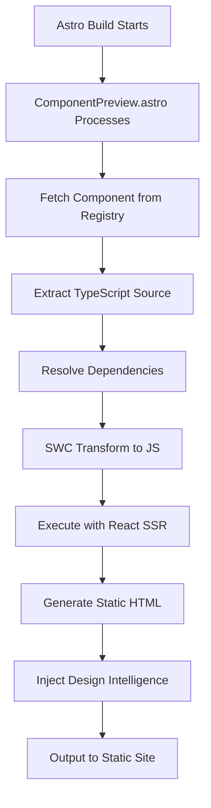

# ComponentPreview SWC Architecture
## Real Component Rendering for Astro Documentation

*Server-side TypeScript compilation for authentic component previews with embedded design intelligence*

---

## Vision

Transform the ComponentPreview system from hardcoded HTML approximations to authentic component rendering using SWC compilation at build time. This enables documentation that shows real Rafters components with their full design intelligence, behavior, and styling while maintaining performance and accessibility.

## Current Problems

### Hardcoded HTML Approximations
- ComponentPreview generates fake HTML that looks like components but lacks real behavior
- No actual component intelligence, just static previews
- Maintenance burden keeping fake HTML in sync with real components
- Missing interactive features, state management, and proper styling

### Lost Design Intelligence
- Component JSDoc intelligence not reflected in previews
- Trust building patterns not demonstrated
- Attention economics not visible in documentation
- Cognitive load assessments disconnected from actual usage

### Documentation-Code Drift
- Real components evolve separately from documentation examples
- Examples become outdated and misleading
- Component intelligence metadata not leveraged in docs

## Solution: SWC Build-Time Compilation

### Core Architecture
Use SWC (Speedy Web Compiler) at Astro build time to:
1. **Fetch real component source** from registry at build time
2. **Compile TypeScript/JSX** to executable JavaScript 
3. **Render components to HTML** using React server-side rendering
4. **Inject into Shadow DOM** for style isolation and interactivity
5. **Preserve component intelligence** metadata in documentation

### Build-Time Process Flow


## Technical Implementation

### SWC ComponentRenderer Class
```typescript
class SWCComponentRenderer {
  private cache: Map<string, string> = new Map();
  private dependencyResolver: DependencyResolver;
  
  async renderComponentToHTML(
    componentSource: string,
    props: ComponentProps,
    options: RenderOptions
  ): Promise<RenderedComponent>
}
```

### Dependency Resolution Strategy
1. **Internal Dependencies**: Bundle utilities like `cn()` from local registry
2. **External Dependencies**: Resolve Radix UI and other packages from node_modules
3. **Design Tokens**: Inject TokenRegistry values at compile time
4. **Semantic Imports**: Transform relative imports to absolute module paths

### Astro Integration Pattern
```astro
---
// ComponentPreview.astro
import { SWCRenderer } from '../lib/swc-renderer';
const renderer = new SWCRenderer();

// Build-time compilation
const registryData = await fetchComponentData(component);
const renderedHTML = await renderer.renderComponentToHTML(
  registryData.source, 
  props
);
---

<div class="component-preview">
  <!-- Server-rendered component HTML injected here -->
</div>

<script define:vars={{ renderedHTML }}>
  // Client-side Shadow DOM injection
  attachShadowDOMWithHTML(renderedHTML);
</script>
```

## Design Intelligence Integration

### Component Metadata Preservation
- **Cognitive Load**: Display in preview interface
- **Attention Economics**: Highlight usage patterns 
- **Trust Building**: Demonstrate confirmation patterns
- **Accessibility**: Show ARIA attributes and screen reader content
- **Usage Patterns**: Display DO/NEVER guidelines

### Intelligence Display Modes
1. **Code Mode**: Show actual component source with syntax highlighting
2. **Preview Mode**: Rendered component with interaction capabilities  
3. **Intelligence Mode**: Design metadata and cognitive load analysis
4. **Accessibility Mode**: ARIA tree, keyboard navigation testing
5. **Variants Mode**: All component variants with usage context

## Performance Characteristics

### Build-Time Advantages
- **Zero Runtime Cost**: All compilation happens during build
- **Static HTML Output**: Perfect caching and CDN optimization
- **Pre-rendered Intelligence**: Design metadata compiled into static content
- **Bundle Size**: No SWC or compilation overhead in client bundle

### Caching Strategy
- **Component Source Caching**: Cache compiled components by hash
- **Dependency Resolution Caching**: Cache module resolution results
- **Registry Data Caching**: Cache component metadata between builds
- **Incremental Compilation**: Only recompile changed components

## Accessibility Implementation

### WCAG AAA Compliance
- **Shadow DOM Accessibility**: Proper ARIA roles and states
- **Keyboard Navigation**: Full keyboard access to all previews  
- **Screen Reader Testing**: Automated testing with @axe-core/playwright
- **Focus Management**: Proper focus trapping and restoration
- **High Contrast Support**: Design tokens provide automatic compliance

### Testing Integration
- **Visual Regression**: Capture screenshots of all component variants
- **Interaction Testing**: Verify all interactive patterns work correctly
- **Screen Reader Testing**: Automated NVDA, JAWS, VoiceOver validation
- **Keyboard Navigation**: Automated keyboard accessibility testing

## Security Considerations

### Build-Time Safety
- **No Runtime Code Execution**: All compilation happens server-side
- **Source Code Validation**: Validate component source before compilation
- **Dependency Scanning**: Security scanning of resolved dependencies
- **Output Sanitization**: HTML output sanitization for XSS prevention

### Content Security Policy
- **Static Content**: All generated HTML is static and trusted
- **Shadow DOM Isolation**: Component styles isolated from page styles
- **No Dynamic Imports**: All dependencies resolved at build time

## Error Handling & Fallbacks

### Compilation Error Recovery
1. **SWC Compilation Fails**: Fall back to syntax-highlighted source code
2. **Dependency Resolution Fails**: Show component signature with error message  
3. **React Rendering Fails**: Display component metadata with compilation error
4. **Registry Unavailable**: Use cached component data or show placeholder

### Development vs Production
- **Development**: Show detailed error messages and compilation logs
- **Production**: Graceful degradation with minimal error information
- **Build Failures**: Fail fast with clear error messages during CI

## Implementation Phases

### Phase 1: Core SWC Infrastructure
- SWC ComponentRenderer class with basic compilation
- Registry integration for component source fetching
- Basic dependency resolution for internal utilities
- Simple HTML generation without complex interactions

### Phase 2: Advanced Features  
- Full dependency resolution including external packages
- Design intelligence metadata integration
- Shadow DOM with proper styling and isolation
- Interactive preview modes (code, preview, intelligence)

### Phase 3: Testing & Accessibility
- Comprehensive accessibility testing framework
- Visual regression testing for all components
- Screen reader automation and keyboard navigation
- Performance monitoring and optimization

### Phase 4: Developer Experience
- Hot reload during development
- Error reporting and debugging tools  
- Component intelligence editing interface
- CI/CD integration and build optimization

## Success Metrics

### Technical Metrics
- **Build Time**: Component compilation adds <5 seconds to total build
- **Bundle Size**: No increase in client bundle size
- **Performance**: All previews render in <100ms on slow devices
- **Accessibility**: 100% WCAG AAA compliance across all components

### User Experience Metrics  
- **Documentation Accuracy**: Real components eliminate documentation drift
- **Developer Adoption**: Component preview usage increases
- **Intelligence Utilization**: Design intelligence guides actual component usage
- **Accessibility Compliance**: AI agents correctly apply accessibility patterns

## Architecture Benefits

### For Documentation
- **Authentic Examples**: Real components with real behavior
- **Automatic Updates**: Documentation stays current with component changes
- **Interactive Learning**: Users can interact with actual components
- **Design Intelligence**: Cognitive load and usage patterns clearly demonstrated

### For AI Agents
- **Real Component Intelligence**: Access to actual component behavior patterns
- **Embedded Design Decisions**: Trust building and attention economics visible
- **Consistent Implementation**: AI sees exactly how components should behave
- **Accessibility Guidance**: ARIA patterns and keyboard navigation demonstrated

### For Developers  
- **Single Source of Truth**: Components and documentation unified
- **Zero Maintenance**: No need to maintain separate documentation examples
- **Design System Adoption**: Clear usage patterns and intelligence guidance
- **Performance Confidence**: Build-time compilation ensures production readiness

---

## Next Steps

This design document serves as the foundation for breaking down implementation into focused GitHub issues covering:

1. **SWC Infrastructure**: Core compilation and rendering engine
2. **Registry Integration**: Component source fetching and caching
3. **Dependency Resolution**: Module resolution and bundling strategy  
4. **Astro Integration**: Build-time compilation and static generation
5. **Shadow DOM Implementation**: Style isolation and interactivity
6. **Design Intelligence Display**: Metadata visualization and interaction
7. **Accessibility Framework**: Testing and compliance automation
8. **Performance Optimization**: Caching, incremental compilation, monitoring

Each implementation phase will be broken into specific, actionable issues following the established Rafters issue template with exact implementation requirements, acceptance criteria, and success metrics.