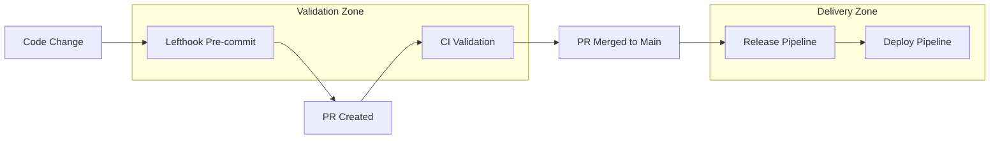

# Optimized Release Pipeline

This document outlines our **best-practice release pipeline** that separates validation from delivery for maximum speed and reliability.

## 🎯 Philosophy: Trust the Pipeline

**"If it passed the gate, ship it fast"** - Netflix/Spotify approach

Our pipeline follows the principle that **releases should be about DELIVERY, not RE-VALIDATION**.

## 🔄 Pipeline Overview



## 🛡️ Validation Pipeline (CI)

**Purpose**: Comprehensive validation and quality assurance

**Triggers**: 
- Pull requests to `main`
- Push to `main`

**Steps**:
1. **Install dependencies** + Playwright browsers
2. **Run preflight checks** (biome, typecheck, tests, build)
3. **Changeset validation** (PR only)

**Duration**: ~3-5 minutes
**Failures**: Block merge, require fixes

## 🚀 Release Pipeline

**Purpose**: Pure delivery - trust CI validation, ship fast

**Triggers**: 
- Push to `main` (after CI passes)

**Steps**:
1. **Build for distribution** (not validation)
2. **Generate registry manifest**
3. **Publish to npm** (changesets)
4. **Update registry** (if released)

**Duration**: ~1-2 minutes
**No Redundant Testing**: CI already validated everything

## 📦 Deploy Pipeline

**Purpose**: Deploy documentation and registry

**Triggers**:
- Successful release workflow
- Manual trigger

**Steps**:
1. **Build Storybook** for documentation
2. **Deploy to GitHub Pages** 
3. **Update registry hosting**
4. **Notify team** of deployment

## 🛠️ Local Development Scripts

```bash
# Development
pnpm dev                    # Start all dev servers
pnpm preflight             # Full validation (runs in CI)

# Release Testing
pnpm release:dry           # Test release locally (no publish)
pnpm release:local         # Full local release (with publish)

# Deployment
pnpm deploy:storybook      # Build storybook
pnpm deploy:registry       # Generate registry manifest

# Changesets
pnpm changeset             # Add changeset
pnpm changeset:check       # Check changeset status
```

## ✅ Benefits of This Approach

### **Speed**
- **Release**: 1-2 minutes (vs 5-8 minutes with redundant testing)
- **Deploy**: 2-3 minutes 
- **Total**: ~3-5 minutes end-to-end

### **Reliability**
- **Fewer failure points** in release pipeline
- **CI failures caught early** in PR process
- **Release failures are rare** (packaging/publishing only)

### **Cost Efficiency**
- **No redundant compute** - don't re-run tests/builds
- **Faster feedback loops**
- **Lower CI costs**

### **Developer Experience**
- **Fast releases** encourage frequent publishing
- **Clear separation** of concerns (validate vs deliver)
- **Predictable timelines**

## 🚨 Troubleshooting

### Release Fails
1. **Check changeset format** - `pnpm changeset:check`
2. **Verify NPM token** - Check GitHub secrets
3. **Test locally first** - `pnpm release:dry`

### Deploy Fails
1. **Check GitHub Pages** - Verify permissions
2. **Verify Storybook build** - `pnpm deploy:storybook`
3. **Manual trigger** - Use workflow_dispatch

### CI Fails
1. **Run preflight locally** - `pnpm preflight`
2. **Check specific step** - biome, typecheck, test, build
3. **Playwright issues** - Clear browser cache

## 📋 Maintenance

### Monthly
- **Review pipeline metrics** - duration, failure rates
- **Update dependencies** - GitHub Actions, pnpm
- **Clean up old releases** - npm/GitHub

### Quarterly  
- **Audit secrets** - rotate NPM tokens
- **Review permissions** - GitHub repository settings
- **Optimize build times** - dependency caching

## 🔗 Related Documentation

- [Changesets Guide](https://github.com/changesets/changesets/blob/main/docs/intro.md)
- [GitHub Actions Best Practices](https://docs.github.com/en/actions/learn-github-actions/essential-features-of-github-actions)
- [PNPM Workspaces](https://pnpm.io/workspaces)

---

**Remember**: This pipeline is designed for **speed and reliability**. Trust the validation, ship fast! 🚀