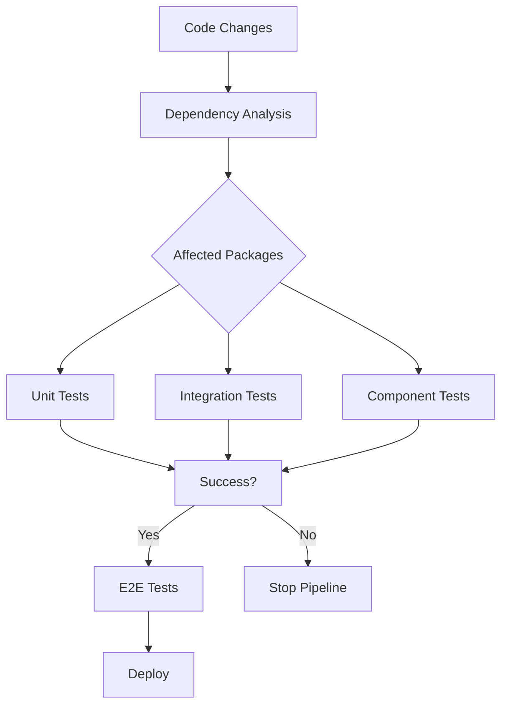

# 🧪 Rafters Monorepo Testing Architecture

A comprehensive, future-ready testing system designed for massive scale, intelligent execution, and AI-driven optimization.

## 🏗️ Architecture Overview

This testing architecture provides a complete solution for modern monorepo testing with:

- **Workspace-aware orchestration** across all packages and apps
- **Progressive test pipeline** (unit → integration → component → e2e)
- **Dependency-aware selective testing**
- **Parallel execution with intelligent sharding**
- **AI-driven insights and optimization**
- **Distributed execution across cloud providers**
- **Real-time performance monitoring and cost optimization**

## 📁 File Structure

```
rafters/
├── vitest.workspace.ts              # Root workspace configuration
├── vitest.config.ts                 # Base configuration
├── test/                            # Shared testing infrastructure
│   ├── setup/
│   │   ├── global.setup.ts         # Global test environment
│   │   └── component.setup.ts      # Component testing setup
│   ├── utils/
│   │   └── test-helpers.ts         # Comprehensive test utilities
│   ├── fixtures/                   # Test data and fixtures
│   └── mocks/                      # Shared mocks
├── scripts/                        # Testing orchestration scripts
│   ├── test-orchestrator.mjs       # Main test orchestration
│   ├── test-result-aggregator.mjs  # Result aggregation
│   ├── ai-test-analyzer.mjs        # AI-driven analysis
│   └── distributed-test-coordinator.mjs # Distributed execution
├── .github/workflows/
│   └── test-matrix.yml             # CI/CD testing matrix
└── docs/
    └── TESTING_ARCHITECTURE.md     # This documentation
```

## 🚀 Quick Start

### Basic Commands

```bash
# Run all tests across monorepo
pnpm test

# Run only affected tests (based on changes)
pnpm test:affected

# Run specific test types
pnpm test:unit
pnpm test:integration
pnpm test:component
pnpm test:e2e

# Progressive testing (stops on first failure)
pnpm test:progressive
```

### Advanced Commands

```bash
# Watch mode with workspace awareness
pnpm test:watch

# Coverage analysis
pnpm test:coverage
pnpm test:coverage:unit
pnpm test:coverage:integration

# Performance and benchmarking
pnpm test:performance
pnpm test:benchmark
pnpm test:memory

# CI-optimized commands
pnpm test:ci
pnpm test:ci:sharded
pnpm test:ci:parallel
```

### Future-Ready Commands

```bash
# AI-driven test insights
pnpm test:ai-insights

# Distributed testing coordination
pnpm test:distributed

# Smart test selection
pnpm test:smart
```

## 🏛️ Core Architecture Components

### 1. Workspace Configuration (`vitest.workspace.ts`)

Orchestrates testing across the entire monorepo with specialized configurations for:

- **Unit Testing**: Fast, isolated tests using Node environment
- **Integration Testing**: Cloudflare Workers runtime with real bindings
- **Component Testing**: Browser-based component testing with Playwright
- **Package-Specific**: Tailored configs for each package's needs

### 2. Test Orchestrator (`scripts/test-orchestrator.mjs`)

Intelligent test execution with:

- **Dependency Analysis**: Understands package relationships
- **Selective Testing**: Only runs tests for affected packages
- **Optimal Execution Order**: Respects dependency chains
- **Parallel Processing**: Concurrent execution with resource limits
- **Failure Recovery**: Smart retry strategies

### 3. Test Environment Setup

#### Global Setup (`test/setup/global.setup.ts`)
- Environment validation and consistency
- Global mocks and polyfills
- Performance monitoring
- React 19 compatibility
- Cloudflare Workers polyfills

#### Component Setup (`test/setup/component.setup.ts`)
- React testing utilities
- Design system context
- Accessibility testing integration
- Visual regression preparation
- Component intelligence validation

### 4. Test Utilities (`test/utils/test-helpers.ts`)

Comprehensive testing toolkit:

- **Component Testing**: Enhanced render functions with design system context
- **API Testing**: Cloudflare Workers environment mocking
- **Accessibility**: Color contrast, keyboard navigation, ARIA validation
- **Performance**: Render time, memory usage, bundle size monitoring
- **Design System**: Token validation, color space testing

## 🔄 Testing Pipeline

### Progressive Test Stages

1. **Unit Tests** (Fast feedback)
   - Pure function testing
   - Utility validation
   - Business logic verification
   - Runs in Node.js environment

2. **Integration Tests** (Environment validation)
   - API endpoint testing
   - Service integration
   - Database operations
   - Runs in Cloudflare Workers runtime

3. **Component Tests** (UI validation)
   - Component behavior
   - User interactions
   - Accessibility compliance
   - Runs in real browsers via Playwright

4. **E2E Tests** (User journey validation)
   - Complete user workflows
   - Cross-browser compatibility
   - Performance in real conditions
   - Runs against deployed applications

### Dependency-Aware Execution



## 🤖 AI-Driven Testing Intelligence

### Test Analysis (`scripts/ai-test-analyzer.mjs`)

- **Failure Pattern Recognition**: Identifies recurring issues
- **Performance Optimization**: Suggests test improvements
- **Coverage Gap Analysis**: Recommends new tests
- **Risk Assessment**: Evaluates testing completeness
- **Predictive Insights**: Forecasts testing trends

### Smart Test Selection

- **Historical Performance**: Learns from past execution data
- **Change Impact Analysis**: Predicts which tests are likely to fail
- **Resource Optimization**: Balances coverage vs. execution time
- **Flaky Test Detection**: Identifies and suggests fixes for unreliable tests

## 🌐 Distributed Testing System

### Multi-Cloud Coordination (`scripts/distributed-test-coordinator.mjs`)

Supports execution across:

- **GitHub Actions**: Standard CI/CD integration
- **AWS CodeBuild**: High-performance compute instances
- **Azure DevOps**: Enterprise integration
- **Google Cloud Build**: Cost-effective parallel execution
- **Cloudflare Workers**: Ultra-fast unit test execution
- **Self-Hosted Runners**: Maximum control and customization

### Features:

- **Cost Optimization**: Automatic selection of most cost-effective runners
- **Load Balancing**: Intelligent distribution across available resources
- **Health Monitoring**: Real-time runner performance tracking
- **Failure Recovery**: Automatic retry on different infrastructure
- **Scaling Intelligence**: Dynamic resource allocation

## 📊 Reporting and Analytics

### Test Result Aggregation

Comprehensive result analysis with:

- **Cross-Platform Aggregation**: Combines results from all runners
- **Performance Metrics**: Execution time, resource usage, cost analysis
- **Trend Analysis**: Historical data comparison and insights
- **Visual Reports**: HTML dashboards and markdown summaries

### Key Metrics Tracked:

- Test execution times and trends
- Flaky test identification and patterns
- Coverage evolution over time
- Cost per test execution
- Runner performance and reliability
- Browser compatibility matrices

## 🔧 Configuration

### Environment Variables

```bash
# Test execution control
TEST_CONCURRENCY=4              # Parallel test limit
MAX_THREADS=4                   # Thread pool size
SHARD_INDEX=1                   # Current shard (CI)
SHARD_COUNT=4                   # Total shards (CI)

# AI and external services
CLAUDE_API_KEY=sk-...           # AI analysis (optional)
RAFTERS_INTEL=...               # KV store binding

# Performance and monitoring
PERFORMANCE_BUDGET=30000        # Max test execution time (ms)
MEMORY_LIMIT=512                # Memory limit (MB)
COVERAGE_THRESHOLD=80           # Minimum coverage percentage
```

### Package-Level Configuration

Each package can define specific testing needs in `package.json`:

```json
{
  "scripts": {
    "test": "vitest run",
    "test:watch": "vitest",
    "test:coverage": "vitest run --coverage"
  },
  "rafters": {
    "testing": {
      "priority": "high",
      "requirements": {
        "browser": false,
        "cloudflare": true,
        "memory": "512MB"
      }
    }
  }
}
```

## 🎯 Best Practices

### Test Organization

1. **Mirror Source Structure**: Test files parallel source organization
2. **Naming Conventions**:
   - `*.test.ts` - Unit tests
   - `*.spec.ts` - Integration tests
   - `*.e2e.ts` - End-to-end tests
   - `*.component.test.ts` - Component tests

3. **Test Categories**:
   - **Unit**: Fast, isolated, deterministic
   - **Integration**: Environment-aware, external dependencies
   - **Component**: Browser-based, user interaction focused
   - **E2E**: Full user journey, real environment

### Writing Effective Tests

1. **Use AAA Pattern**: Arrange, Act, Assert
2. **Descriptive Names**: Tests should read like specifications
3. **Single Responsibility**: One concept per test
4. **Deterministic**: Same inputs always produce same outputs
5. **Independent**: Tests should not depend on each other

### Performance Optimization

1. **Parallel Execution**: Leverage multiple cores and workers
2. **Smart Caching**: Cache test results and dependencies
3. **Resource Limits**: Set appropriate timeouts and memory limits
4. **Selective Testing**: Only run tests for changed code
5. **Progressive Enhancement**: Start with unit tests, add complexity

## 🔮 Future Roadmap

### Near-term (2025)

- [ ] AI test generation based on code changes
- [ ] Visual regression testing integration
- [ ] Performance budget enforcement
- [ ] Advanced flaky test detection

### Medium-term (2025-2026)

- [ ] Machine learning for test optimization
- [ ] Cross-repository test coordination
- [ ] Automated test maintenance
- [ ] Predictive failure detection

### Long-term (2026+)

- [ ] Self-healing test suites
- [ ] Quantum computing test acceleration
- [ ] Natural language test specification
- [ ] Autonomous testing system evolution

## 📚 Resources

### Documentation
- [Vitest Documentation](https://vitest.dev/)
- [Playwright Component Testing](https://playwright.dev/docs/test-components)
- [Cloudflare Workers Testing](https://developers.cloudflare.com/workers/testing/)

### Tools and Libraries
- **Vitest**: Modern testing framework
- **Playwright**: Browser automation and testing
- **@cloudflare/vitest-pool-workers**: Workers runtime testing
- **@testing-library/react**: React testing utilities
- **happy-dom**: Fast DOM implementation

### Example Projects
- Check `packages/*/test/` for package-specific examples
- See `apps/*/test/` for application testing patterns
- Review `.github/workflows/test-matrix.yml` for CI configuration

---

This testing architecture represents a forward-thinking approach to monorepo testing, designed to scale with your project while maintaining speed, reliability, and cost-effectiveness. The system grows more intelligent over time, learning from your codebase and optimizing execution patterns automatically.

**Remember**: Great tests are not just about coverage—they're about confidence. This architecture ensures you can ship with confidence while maintaining velocity.