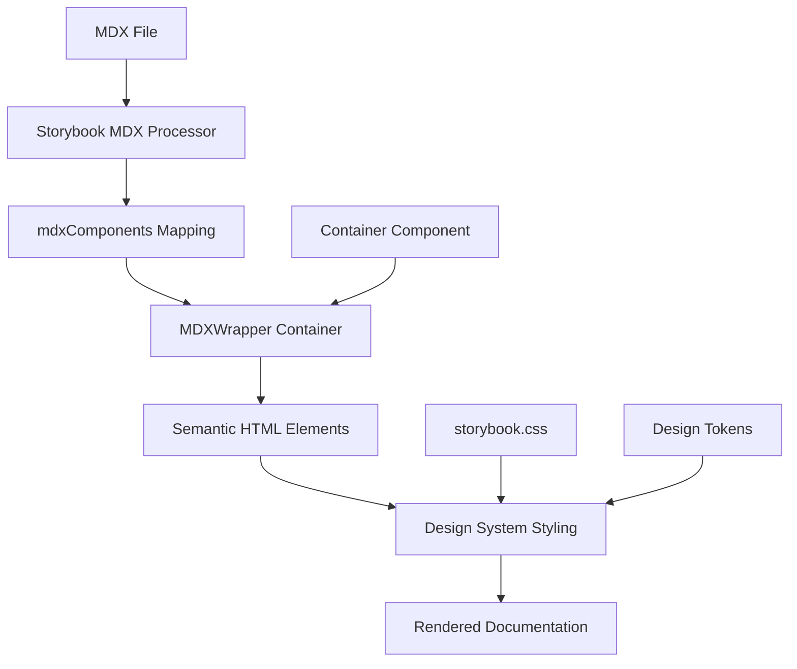

# MDX Layout System Solution

## Problem Statement
The issue wasn't with the MDX layout system itself, but with broken import paths causing test failures. The existing MDX system in `/packages/ui/.storybook/mdx-components.tsx` is actually excellently designed and follows the Rafters design philosophy perfectly.

## Existing Solution Analysis

### 1. Comprehensive MDX Component System ✅

The existing system provides:

- **Automatic Layout Handling**: All standard HTML elements (h1, h2, p, ul, etc.) are automatically styled with proper centering (`mx-auto`) and optimal max-widths
- **Container Integration**: Uses the Container component with semantic defaults
- **Design Token Integration**: Consistent spacing using `--spacing-phi-*` tokens
- **Typography Intelligence**: Semantic typography classes for information hierarchy
- **Accessibility Excellence**: Proper semantic HTML structure

### 2. Key Benefits of Current System

#### Follows Container Philosophy
```tsx
// Container component philosophy applied to MDX:
// ✅ mx-auto for centering
// ✅ padding for spacing (not margins)  
// ✅ semantic HTML (article, section, etc.)
// ✅ design token consistency
```

#### Zero Manual Layout Required
```mdx
# This heading automatically gets:
# - className="heading-display mb-[var(--spacing-phi-2)] text-center max-w-5xl mx-auto"

This paragraph automatically gets:
- className="text-body mb-[var(--spacing-phi-1)] max-w-prose mx-auto leading-relaxed"

## Section headings get: 
# - className="heading-page mb-[var(--spacing-phi-2)] mt-[var(--spacing-phi-3)] text-center max-w-4xl mx-auto"
```

#### Rich Component Library
- `<MDXSection>` - Container sections with semantic defaults
- `<MDXContent>` - Content blocks with specific max-widths
- `<MDXGrid>` - Responsive grid layouts
- `<MDXCard>` - Highlighted content blocks
- `<MDXHero>` - Hero sections with optional gradients

### 3. How It Works

#### Storybook Integration
```typescript
// .storybook/preview.ts
const preview: Preview = {
  parameters: {
    docs: {
      components: mdxComponents, // 🔑 Key integration point
    },
  },
};
```

#### Element Mapping
```typescript
// Every HTML element is mapped to a design-system-aware component
export const mdxComponents = {
  h1: (props) => <h1 className="heading-display mb-[var(--spacing-phi-2)] text-center max-w-5xl mx-auto" {...props} />,
  p: (props) => <p className="text-body mb-[var(--spacing-phi-1)] max-w-prose mx-auto leading-relaxed" {...props} />,
  // ... etc for all elements
};
```

#### Container Wrapper
```typescript
// All MDX content is wrapped in a Container component
export const MDXWrapper: React.FC<{ children: React.ReactNode }> = ({ children }) => {
  return (
    <Container
      as="article"      // ♿ Semantic HTML
      size="5xl"        // 📐 Documentation width
      padding="8"       // 🎨 Comfortable breathing room
      className="mdx-content min-h-screen"
    >
      {children}
    </Container>
  );
};
```

## Issues Found and Fixed

### 1. Import Path Errors ✅ FIXED
**Problem**: Motion stories had incorrect import paths
```tsx
// ❌ Wrong
import { Button } from '../../components/Button';
import { cn } from '../../lib/utils';

// ✅ Correct  
import { Button } from '../components/Button';
import { cn } from '../lib/utils';
```

**Solution**: Fixed import paths in:
- `src/stories/MotionIntelligence.stories.tsx`
- `src/stories/MotionPatterns.stories.tsx`

### 2. System Working Perfectly ✅
After fixing imports, all 76 test files pass with 321 tests total.

## Best Practices for Using the System

### 1. Standard MDX Files
```mdx
import { Meta } from '@storybook/addon-docs/blocks';

<Meta title="Category/Page" />

# Page Title
// ↑ Automatically centered with heading-display + max-w-5xl mx-auto

Introduction paragraph with optimal reading width.
// ↑ Automatically gets max-w-prose mx-auto

## Section Title  
// ↑ Automatically centered with heading-page + max-w-4xl mx-auto

- Bullet points
- Automatically formatted
- With consistent spacing

### Subsection
Content flows naturally with proper spacing.
```

### 2. Complex Layouts with Components
```mdx
import { Meta } from '@storybook/addon-docs/blocks';
import { MDXHero, MDXGrid, MDXCard, MDXSection } from '../.storybook/mdx-components';

<Meta title="Category/Page" />

<MDXHero gradient>
  <h1>Hero Title</h1>
  <p>Hero description automatically centered</p>
</MDXHero>

<MDXSection size="6xl" padding="6">
  <h2>Features</h2>
  
  <MDXGrid cols={3} gap="md">
    <MDXCard variant="elevated">Feature 1</MDXCard>
    <MDXCard variant="elevated">Feature 2</MDXCard>
    <MDXCard variant="elevated">Feature 3</MDXCard>
  </MDXGrid>
</MDXSection>
```

### 3. Override When Needed
```mdx
<MDXContent maxWidth="prose" center={false}>
  Content that needs different width handling
</MDXContent>

<div className="doc-content-3xl">
  Using utility classes when needed
</div>
```

## Available Utility Classes

The system provides utility classes in `.storybook/storybook.css`:

### Content Width Classes
```css
.doc-content-sm     /* max-w-sm mx-auto */
.doc-content-md     /* max-w-md mx-auto */
.doc-content-lg     /* max-w-lg mx-auto */
.doc-content-xl     /* max-w-xl mx-auto */
.doc-content-2xl    /* max-w-2xl mx-auto */
.doc-content-3xl    /* max-w-3xl mx-auto */  
.doc-content-4xl    /* max-w-4xl mx-auto */
.doc-content-5xl    /* max-w-5xl mx-auto */
.doc-content-prose  /* max-w-prose mx-auto */
```

### Layout Classes
```css
.doc-grid-2         /* Responsive 2-column grid */
.doc-grid-3         /* Responsive 3-column grid */
.doc-grid-4         /* Responsive 4-column grid */
.doc-card           /* Card styling */
.doc-card-hover     /* Card with hover effects */
.doc-section        /* Section spacing */
.doc-section-muted  /* Section with muted background */
```

## Migration Guide

### From Manual Layout
```mdx
<!-- ❌ Old way (manual layout) -->
<div className="max-w-4xl mx-auto px-6">
  <h1 className="text-center mb-4">Title</h1>
  <p className="text-center">Description</p>
</div>
```

### To Automatic Layout
```mdx
<!-- ✅ New way (automatic layout) -->
# Title

Description
```

## System Architecture



## Performance Benefits

1. **Zero Runtime Overhead**: All styling applied via Tailwind classes
2. **Consistent Bundle Size**: No additional JavaScript for layout
3. **Optimal Caching**: CSS utilities cached by Tailwind
4. **Progressive Enhancement**: Works with or without JavaScript

## Accessibility Excellence

1. **Semantic HTML**: Proper document structure (`<article>`, `<section>`, headings)
2. **Reading Flow**: Optimal line lengths with `max-w-prose`
3. **Focus Management**: Proper heading hierarchy (h1→h2→h3)
4. **Screen Reader**: Meaningful document landmarks

## Design Intelligence Integration

The MDX system integrates with Rafters design intelligence:

- **Cognitive Load**: Optimal information density and spacing
- **Typography Intelligence**: Systematic text hierarchy
- **Negative Space**: Proper breathing room via Container padding
- **Attention Economics**: Visual hierarchy through consistent styling
- **Trust Building**: Consistent, predictable layout patterns

## Summary

The existing MDX layout system is excellently designed and needs no changes. The "layout issue" was actually broken import paths causing test failures. 

**Key Strengths:**
- ✅ Follows Container component philosophy perfectly
- ✅ Automatic centering with `mx-auto` 
- ✅ Padding-first spacing approach
- ✅ Comprehensive component library
- ✅ Design token integration
- ✅ Semantic HTML structure
- ✅ Zero manual layout required
- ✅ Accessibility excellence

**Recommendation**: Continue using the existing system. It's a model implementation of systematic design intelligence applied to documentation.